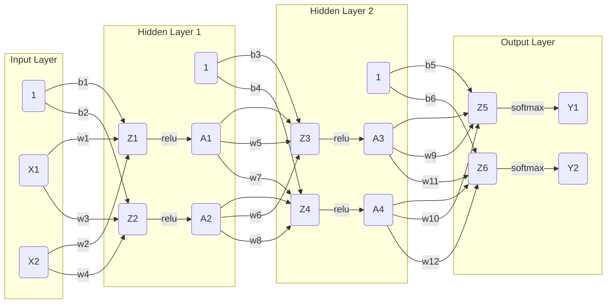

# Deep Learning from Scratch in C Accelerated by CUDA
This repository includes the code for implementing a Deep Neural Network from scratch in C accelerated by CUDA.The problem being solved is the training a Neural Network to classifiy handwritten digits from the MNIST dataset. A detailed explanation of the underlying linear algebra and calculus behing forward and backward propagation is provided below.

## Forward Propagation

The forward propagation algorithm has the following steps:

1. Calculate the weighted sum of the inputs of each layer for each neuron in that layer (one neuron for every combination of inputs and outputs).
2. Apply the activation function to the weighted sum of the inputs of each layer for each neuron in that layer.
3. Repeat steps 1 and 2 for each layer.



Note: The $X,$ $Z,$ $A,$ and $Y$ elements in the diagram above are vectors not scalars and have lengths equal to the number of training examples. On the other hand, the weights and biases are indeed scalar values.

In the example above,
- $X_1$ and $X_2$ can be combined into the matrix $\mathbf{X}$ which has a shape of (2, 3), signifying the input data with 2 features (input units) and 3 samples.

$$
\mathbf{X} = \begin{bmatrix}
x_{11} & x_{12} & x_{13} \\
x_{21} & x_{22} & x_{23}
\end{bmatrix}
$$

- The weights in the first layer can be represented by the matrix $\mathbf{W_{Layer 1}}$ which has a shape of (2, 2). Since there has to be a weight connecting each input node to each output node in each layer, $\mathbf{W_{Layer 1}}$ has one column for each input node and one row for each output node.

$$
\mathbf{W_{Layer 1}} = \begin{bmatrix}
w_{1} & w_{2} \\
w_{3} & w_{4}
\end{bmatrix}
$$

- The biases can be represented by the vector $\mathbf{b_{Layer 1}}$ which has a shape of (2, 1), indicating the bias vector for the first layer has 2 bias terms, one for each output node.

$$
\mathbf{b_{Layer 1}} = \begin{bmatrix}
b_{1} \\
b_{2}
\end{bmatrix}
$$

Furthermore, $\mathbf{Z_{Layer 1}}$ can be calculated as follows:

$$
\mathbf{Z_{Layer 1}} = \mathbf{W_{Layer 1}} \cdot \mathbf{X} + \mathbf{b_{Layer 1}}
$$

which can be expanded to:

$$
\mathbf{Z_{Layer 1}} =
\begin{bmatrix}
w_{1} & w_{2} \\
w_{3} & w_{4}
\end{bmatrix} \cdot \begin{bmatrix}
x_{11} & x_{12} & x_{13} \\
x_{21} & x_{22} & x_{23}
\end{bmatrix} + \begin{bmatrix}
b_{1} \\
b_{2}
\end{bmatrix}
$$

which results in

$$
\begin{equation}
\mathbf{Z_{Layer 1}} = \begin{bmatrix}
(w_{1} \cdot x_{11} + w_{2} \cdot x_{21}) & (w_{1} \cdot x_{12} + w_{2} \cdot x_{22}) & (w_{1} \cdot x_{13} + w_{2} \cdot x_{23}) \\
(w_{3} \cdot x_{11} + w_{4} \cdot x_{21}) & (w_{3} \cdot x_{12} + w_{4} \cdot x_{22}) & (w_{3} \cdot x_{13} + w_{4} \cdot x_{23})
\end{bmatrix} + \begin{bmatrix}
b_{1} \\
b_{2}
\end{bmatrix}
\end{equation}
$$

adding the bias vector to the matrix results in

$$
\begin{equation}
\mathbf{Z_{Layer 1}} = \begin{bmatrix}
w_{1} \cdot x_{11} + w_{2} \cdot x_{21} + b_{1} & w_{1} \cdot x_{12} + w_{2} \cdot x_{22} + b_{1} & w_{1} \cdot x_{13} + w_{2} \cdot x_{23} + b_{1} \\
w_{3} \cdot x_{11} + w_{4} \cdot x_{21} + b_{2} & w_{3} \cdot x_{12} + w_{4} \cdot x_{22} + b_{2} & w_{3} \cdot x_{13} + w_{4} \cdot x_{23} + b_{2}
\end{bmatrix}
\end{equation}
$$

which can be further simplified to

$$
\begin{equation}
\mathbf{Z_{Layer 1}} = \begin{bmatrix}
z_{11} & z_{12} & z_{13} \\
z_{21} & z_{22} & z_{23}
\end{bmatrix}
\end{equation}
$$

where

$\mathbf{Z_{Layer 1}}$ contains the weighted sums for the first layer, with each element $z_{ij}$ representing the weighted sum of inputs for a particular neuron in the first layer.

Supposing we had an activation Function

$$
\text{relu}(x) = \\begin{cases}
x & \\text{if } x \\ge 0 \\
0 & \\text{if } x < 0
\\end{cases}
$$

we can continue by calculating $\mathbf{A1}$ as follows:

$$
\mathbf{A_{Layer 1}} = \text{relu}(\mathbf{Z_{Layer 1}})
$$

which can be expanded to

$$
\mathbf{A_{Layer 1}} = \begin{bmatrix}
\text{relu}(z_{11}) & \text{relu}(z_{12}) & \text{relu}(z_{13}) \\
\text{relu}(z_{21}) & \text{relu}(z_{22}) & \text{relu}(z_{23})
\end{bmatrix}
$$

and simplified to

$$
\mathbf{A_{Layer 1}} = \begin{bmatrix}
a_{11} & a_{12} & a_{13} \\
a_{21} & a_{22} & a_{23}
\end{bmatrix}
$$

Moving on to the second layer, $mathbf{A_{Layer 1}}$ is now the input to the second layer. Just like in the first hidden layer, the weights in the second hidden layer can be represented by the matrix $\mathbf{W_{Layer 2}}$ and the biases from the second hidden layer can be represented by the vector $b_{Layer 2}$. Therefore, $\mathbf{Z_{Layer 1}}$ can be calculated as follows:

$$
\mathbf{Z_{Layer 2}} = \mathbf{W_{Layer 2}} \cdot \mathbf{A_{Layer 1}} + \mathbf{b_{Layer 2}}
$$

which can be expanded to:

$$
\mathbf{Z_{Layer 2}} =
\begin{bmatrix}
w_{5} & w_{6} \\
w_{7} & w_{8}
\end{bmatrix} \cdot \begin{bmatrix}
a_{11} & a_{12} & a_{13} \\
a_{21} & a_{22} & a_{23}
\end{bmatrix} + \begin{bmatrix}
b_{3} \\
b_{4}
\end{bmatrix}
$$

which results in

$$
\begin{equation}
\mathbf{Z_{Layer 2}} = \begin{bmatrix}
(w_{5} \cdot a_{11} + w_{6} \cdot a_{21}) & (w_{5} \cdot a_{12} + w_{6} \cdot a_{22}) & (w_{5} \cdot a_{13} + w_{6} \cdot a_{23}) \\
(w_{7} \cdot a_{11} + w_{8} \cdot a_{21}) & (w_{7} \cdot a_{12} + w_{8} \cdot a_{22}) & (w_{7} \cdot a_{13} + w_{8} \cdot a_{23})
\end{bmatrix} + \begin{bmatrix}
b_{3} \\
b_{4}
\end{bmatrix}
\end{equation}
$$

adding the bias vector to the matrix results in

$$
\begin{equation}
\mathbf{Z_{Layer 2}} = \begin{bmatrix}
w_{5} \cdot a_{11} + w_{6} \cdot a_{21} + b_{3} & w_{5} \cdot a_{12} + w_{6} \cdot a_{22} + b_{3} & w_{5} \cdot a_{13} + w_{6} \cdot a_{23} + b_{3} \\
w_{7} \cdot a_{11} + w_{8} \cdot a_{21} + b_{4} & w_{7} \cdot a_{12} + w_{8} \cdot a_{22} + b_{4} & w_{7} \cdot a_{13} + w_{8} \cdot a_{23} + b_{4}
\end{bmatrix}
\end{equation}
$$

which can be further simplified to

$$
\begin{equation}
\mathbf{Z_{Layer 2}} = \begin{bmatrix}
z_{11} & z_{12} & z_{13} \\
z_{21} & z_{22} & z_{23}
\end{bmatrix}
\end{equation}
$$

applying the activation function $\text{relu}(x)$ to $\mathbf{Z2}$ results in

$$
\begin{equation}
\mathbf{A_{Layer 2}} = \begin{bmatrix}
\text{relu}(z_{11}) & \text{relu}(z_{12}) & \text{relu}(z_{13}) \\
\text{relu}(z_{21}) & \text{relu}(z_{22}) & \text{relu}(z_{23})
\end{bmatrix}
\end{equation}
$$

which can be simplified to

$$
\begin{equation}
\mathbf{A_{Layer 2}} = \begin{bmatrix}
a_{11} & a_{12} & a_{13} \\
a_{21} & a_{22} & a_{23}
\end{bmatrix}
\end{equation}
$$

Finally, the outputs of the neural network can be calculated as follows:

$$
\mathbf{Z_{Output}} = \mathbf{W_{Output}} \cdot \mathbf{A_{Layer 2}} + \mathbf{b_{Output}}
$$

which can be expanded to:

$$
\mathbf{Z_{Output}} =
\begin{bmatrix}
w_{9} & w_{10} \\
w_{11} & w_{12}
\end{bmatrix} \cdot \begin{bmatrix}
a_{11} & a_{12} & a_{13} \\
a_{21} & a_{22} & a_{23}
\end{bmatrix} + \begin{bmatrix}
b_{5} \\
b_{6}
\end{bmatrix}
$$

which results in

$$
\mathbf{Z_{Output}} = \begin{bmatrix}
(w_{9} \cdot a_{11} + w_{10} \cdot a_{21}) & (w_{9} \cdot a_{12} + w_{10} \cdot a_{22}) & (w_{9} \cdot a_{13} + w_{10} \cdot a_{23}) \\
(w_{11} \cdot a_{11} + w_{12} \cdot a_{21}) & (w_{11} \cdot a_{12} + w_{12} \cdot a_{22}) & (w_{11} \cdot a_{13} + w_{12} \cdot a_{23})
\end{bmatrix} + \begin{bmatrix}
b_{5} \\
b_{6}
\end{bmatrix}
$$

adding the bias vector to the matrix results in

$$
\mathbf{Z_{Output}} = \begin{bmatrix}
w_{9} \cdot a_{11} + w_{10} \cdot a_{21} + b_{5} & w_{9} \cdot a_{12} + w_{10} \cdot a_{22} + b_{5} & w_{9} \cdot a_{13} + w_{10} \cdot a_{23} + b_{5} \\
w_{11} \cdot a_{11} + w_{12} \cdot a_{21} + b_{6} & w_{11} \cdot a_{12} + w_{12} \cdot a_{22} + b_{6} & w_{11} \cdot a_{13} + w_{12} \cdot a_{23} + b_{6}
\end{bmatrix}
$$

which can be further simplified to

$$
\mathbf{Z_{Output}} = \begin{bmatrix}
z_{11} & z_{12} & z_{13} \\
z_{21} & z_{22} & z_{23}
\end{bmatrix}
$$

Finally, in the case of multi-class classification, the softmax activation function

$$
\text{softmax}(x_i) = e^{x_i} / \sum_{j=1}^{n} e^{x_j}
$$

can be applied to $\mathbf{Z_{Output}}$ to get the final output of the neural network $\mathbf{Y}$ as follows:

$$
\mathbf{\hat{Y}} = \begin{bmatrix}
\text{softmax}(z_{11}) & \text{softmax}(z_{12}) & \text{softmax}(z_{13}) \\
\text{softmax}(z_{21}) & \text{softmax}(z_{22}) & \text{softmax}(z_{23})
\end{bmatrix}
$$

which can be simplified to

$$
\mathbf{\hat{Y}} = \begin{bmatrix}
\hat{y_{11}} & \hat{y_{12}} & \hat{y_{13}} \\
\hat{y_{21}} & \hat{y_{22}} & \hat{y_{23}}
\end{bmatrix}
$$

## Backpropagation

The forward propagation algorithm above is used to calculate predictions given a set of inputs. Meanwhile, backward propagation is the algorithm used to update the Neural Network's weights and biases such that they minimize the loss through multiple epochs of training. This is also referred to as training the neural network.

Assuming we are training a neural network for multi-class classification, the loss function used is the Categorical Cross-Entropy loss function:

$$
\text{Categorical Cross-Entropy}(Y, \hat{Y}) = -\sum_{i=1}^{K} y_i \log(\hat{y}_i)
$$

The final layer uses the softmax activation function:

$$
\text{softmax}(x_i) = e^{x_i} / \sum_{j=1}^{n} e^{x_j}
$$

In order to calculate the derivative of the loss function with respect to the output of the final layer before passing it through the activation function, we use the chain rule:

```math
\frac{\partial \text{ Categorical Cross-Entropy}(\mathbf{Y}, \mathbf{\hat{Y}})}{\partial z_{ij}} =
\frac{\partial \text{ Categorical Cross-Entropy}(\mathbf{Y}, \mathbf{\hat{Y}})}{\partial \hat{y}_{ij}} \cdot \frac{\partial \hat{y}_{ij}}{\partial z_{ij}}
```

The derivative of the Categorical Cross-Entropy loss function with respect to the softmax output is:

```math
\frac{\partial \text{ Categorical Cross-Entropy}(\mathbf{Y}, \mathbf{\hat{Y}})}{\partial \hat{y}_{ij}} = - \frac{y_{ij}}{\hat{y}_{ij}}
```

For the derivative of the softmax function with respect to the weighted sum of the inputs of the final layer:

```math
\frac{\partial \hat{y}_{ij}}{\partial z_{ij}} = \hat{y}_{ij} (1 - \hat{y}_{ij})
```

for $\( j = k \)$, and

```math
\frac{\partial \hat{y}_{ij}}{\partial z_{ik}} = -\hat{y}_{ij} \hat{y}_{ik}
```

for $\( j \neq k \)$.

which results in:

```math
\frac{\partial \text{ Categorical Cross-Entropy}(\mathbf{Y}, \mathbf{\hat{Y}})}{\partial z_{ij}} = \left( -\frac{y_{ij}}{\hat{y}_{ij}} \right) \cdot \hat{y}_{ij}(1 - \hat{y}_{ij}) + \sum_{k \neq j} \left( -\frac{y_{ik}}{\hat{y}_{ik}} \right) \cdot (-\hat{y}_{ij}\hat{y}_{ik})
```

which can be simplified to

```math
\frac{\partial \text{ Categorical Cross-Entropy}(\mathbf{Y}, \mathbf{\hat{Y}})}{\partial z_{ij}} = -y_{ij} + {y_{ij}}\hat{y_{ij}} + \sum_{k\neq j}^{K}  y_{ik} \hat{y}_{ij}
```


which generalizes to:

```math
\frac{\partial \text{ Categorical Cross-Entropy}(\mathbf{Y}, \mathbf{\hat{Y}})}{\partial z_{ij}} = -y_{ij} + \hat{y}_{ij} \sum_{k=1}^{K} y_{ik}
```

Since the targets are one-hot encoded, the sum of the targets for each input is 1. Substituing the sum for 1 and rearranging the terms results in:

```math
\frac{\partial \text{ Categorical Cross-Entropy}(\mathbf{Y}, \mathbf{\hat{Y}})}{\partial z_{ij}}
= \hat{y}_{ij} - y_{ij}
```

Which can be rewritten in matrix form as follows:

```math
 \frac{\partial \text{ Categorical Cross-Entropy}(\mathbf{Y}, \mathbf{\hat{Y}})}{\partial \mathbf{Z_{\text{output}}}} = \mathbf{\hat{Y}} - \mathbf{Y}
```

Therefore, the gradient with respect to output layer weights $\mathbf{W_{\text{output}}}$ can be calculated as follows (we are dividing by the number of training examples $m$ to get the average gradient in order to keep the scale of the gradients independent of the batch size):

```math
 \frac{\partial \text{ Categorical Cross-Entropy}(\mathbf{Y}, \mathbf{\hat{Y}})}{\partial \mathbf{W_{\text{output}}}} = \frac{1}{m} \mathbf{A_{\text{Layer 2}}}^T \cdot \frac{\partial \text{ Categorical Cross-Entropy}(\mathbf{Y}, \mathbf{\hat{Y}})}{\partial \mathbf{Z_{\text{output}}}}
```

and the gradient with respect to output layer biases $\mathbf{b_{\text{output}}}$ can be calculated as follows:

 ```math
 \frac{\partial \text{ Categorical Cross-Entropy}(\mathbf{Y}, \mathbf{\hat{Y}})}{\partial \mathbf{b_{\text{output}}}} = \frac{1}{m} \sum \left( \frac{\partial \text{ Categorical Cross-Entropy}(\mathbf{Y}, \mathbf{\hat{Y}})}{\partial \mathbf{Z_{\text{output}}}} \right)
 ```

For all subsquent layers, the relu activation function is used:

$$
\text{relu}(x) = \\begin{cases}
x & \\text{if } x \\ge 0 \\
0 & \\text{if } x < 0
\\end{cases}
$$

The derivative of the relu function with respect to the weighted sum of the inputs of the layer is:

$$
\frac{\partial \text{ relu}(x)}{\partial x} = \\begin{cases}
1 & \\text{if } x \\ge 0 \\
0 & \\text{if } x < 0
\\end{cases}
$$

Furthermore, the gradient of the loss with respect to the weighted sum of the inputs of the layer is (the symbol $\odot$ indicates the Hadamard product, representing element-wise multiplication):

 ```math
 \frac{\partial \text{ Categorical Cross-Entropy}(\mathbf{Y}, \mathbf{\hat{Y}})}{\partial \mathbf{Z_{\text{Layer 2}}}} = \mathbf{W_{\text{output}}}^T \cdot \frac{\partial \text{ Categorical Cross-Entropy}(\mathbf{Y}, \mathbf{\hat{Y}})}{\partial \mathbf{Z_{\text{output}}}}
```

```math
\odot \frac{\partial \text{relu}(\mathbf{Z_{\text{Layer 2}}})}{\partial \mathbf{Z_{\text{Layer 2}}}}
```


Therefore, the gradient with respect to second hidden layer weights $\mathbf{W_{\text{Layer 2}}}$ can be calculated as follows:

```math
 \frac{\partial \text{ Categorical Cross-Entropy}(\mathbf{Y}, \mathbf{\hat{Y}})}{\partial \mathbf{W_{\text{Layer 2}}}} = \frac{1}{m} \mathbf{A_{\text{Layer 1}}}^T \cdot \frac{\partial \text{ Categorical Cross-Entropy}(\mathbf{Y}, \mathbf{\hat{Y}})}{\partial \mathbf{Z_{\text{Layer 2}}}}
```

and the gradient with respect to second hidden layer biases $\mathbf{b_{\text{Layer 2}}}$ can be calculated as follows:

```math
 \frac{\partial \text{ Categorical Cross-Entropy}(\mathbf{Y}, \mathbf{\hat{Y}})}{\partial \mathbf{b_{\text{Layer 2}}}} = \frac{1}{m} \sum \left( \frac{\partial \text{ Categorical Cross-Entropy}(\mathbf{Y}, \mathbf{\hat{Y}})}{\partial \mathbf{Z_{\text{Layer 2}}}} \right)
```

Finally, the gradient with respect to the sum of the inputs of the first hidden layer $\mathbf{Z_{\text{Layer 1}}}$ can be calculated as follows:

```math
 \frac{\partial \text{ Categorical Cross-Entropy}(\mathbf{Y}, \mathbf{\hat{Y}})}{\partial \mathbf{Z_{\text{Layer 1}}}} = \mathbf{W_{\text{Layer 2}}}^T \cdot \frac{\partial \text{ Categorical Cross-Entropy}(\mathbf{Y}, \mathbf{\hat{Y}})}{\partial \mathbf{Z_{\text{Layer 2}}}}
```

```math
\odot \frac{\partial \text{relu}(\mathbf{Z_{\text{Layer 1}}})}{\partial \mathbf{Z_{\text{Layer 1}}}}
```

Therefore, the gradient with respect to first hidden layer weights $\mathbf{W_{\text{Layer 1}}}$ can be calculated as follows:

```math
 \frac{\partial \text{ Categorical Cross-Entropy}(\mathbf{Y}, \mathbf{\hat{Y}})}{\partial \mathbf{W_{\text{Layer 1}}}} = \frac{1}{m} \mathbf{X}^T \cdot \frac{\partial \text{ Categorical Cross-Entropy}(\mathbf{Y}, \mathbf{\hat{Y}})}{\partial \mathbf{Z_{\text{Layer 1}}}}
```

and the gradient with respect to first hidden layer biases $\mathbf{b_{\text{Layer 1}}}$:

```math
 \frac{\partial \text{ Categorical Cross-Entropy}(\mathbf{Y}, \mathbf{\hat{Y}})}{\partial \mathbf{b_{\text{Layer 1}}}} = \frac{1}{m} \sum \left( \frac{\partial \text{ Categorical Cross-Entropy}(\mathbf{Y}, \mathbf{\hat{Y}})}{\partial \mathbf{Z_{\text{Layer 1}}}} \right)
```

## Updating the Weights and Biases using Gradient Descent

The last step in the backpropagation algorithm is to update the weights and biases of the neural network using gradient descent. The weights and biases are updated as follows:

```math
\mathbf{W_{\text{Layer 1}}} = \mathbf{W_{\text{Layer 1}}} - \alpha \cdot \frac{\partial \text{ Categorical Cross-Entropy}(\mathbf{Y}, \mathbf{\hat{Y}})}{\partial \mathbf{W_{\text{Layer 1}}}}
```

```math
\mathbf{b_{\text{Layer 1}}} = \mathbf{b_{\text{Layer 1}}} - \alpha \cdot \frac{\partial \text{ Categorical Cross-Entropy}(\mathbf{Y}, \mathbf{\hat{Y}})}{\partial \mathbf{b_{\text{Layer 1}}}}
```

```math
\mathbf{W_{\text{Layer 2}}} = \mathbf{W_{\text{Layer 2}}} - \alpha \cdot \frac{\partial \text{ Categorical Cross-Entropy}(\mathbf{Y}, \mathbf{\hat{Y}})}{\partial \mathbf{W_{\text{Layer 2}}}}
```

```math
\mathbf{b_{\text{Layer 2}}} = \mathbf{b_{\text{Layer 2}}} - \alpha \cdot \frac{\partial \text{ Categorical Cross-Entropy}(\mathbf{Y}, \mathbf{\hat{Y}})}{\partial \mathbf{b_{\text{Layer 2}}}}
```

```math
\mathbf{W_{\text{output}}} = \mathbf{W_{\text{output}}} - \alpha \cdot \frac{\partial \text{ Categorical Cross-Entropy}(\mathbf{Y}, \mathbf{\hat{Y}})}{\partial \mathbf{W_{\text{output}}}}
```

```math
\mathbf{b_{\text{output}}} = \mathbf{b_{\text{output}}} - \alpha \cdot \frac{\partial \text{ Categorical Cross-Entropy}(\mathbf{Y}, \mathbf{\hat{Y}})}{\partial \mathbf{b_{\text{output}}}}
```

where $\alpha$ is the learning rate.

This algorithm is repeated for a specified number of epochs.

## Number of Trainable Parameters

- Weights: There is one weight for every combination of layer inputs and layer outputs. For example, if a layer has 3 inputs and 2 outputs, then there are 6 weights for that layer.
- Bias: There is one bias for every output of a layer. For example, if a layer has 2 outputs, then there are 2 biases for that layer.
- Parameters: The weights and biases of a neural network are referred to as parameters. The number of trainable parameters is the sum of the model's weights and biases.

## Calculus Review (Chain Rule)
The chain rule is used to calculate the derivative of a function with respect to another function. For example, suppose we have the following functions:

```math
\frac{d}{dx} f(g(x)) = \frac{d}{dx} f(g(x)) \cdot \frac{d}{dx} g(x)
```

## Linear Algebra Review (Vector and Matrix Operations)
The dot product of two vectors is the sum of the products of the corresponding elements of each vector. For example, suppose we have the following vectors:

```math
\mathbf{a} = \begin{bmatrix}
a_{1} \\
a_{2} \\
a_{3}
\end{bmatrix}, \quad

\mathbf{b} = \begin{bmatrix}
b_{1} \\
b_{2} \\
b_{3}
\end{bmatrix}
```

```math
\mathbf{a} \cdot \mathbf{b} = a_{1} \cdot b_{1} + a_{2} \cdot b_{2} + a_{3} \cdot b_{3}
```

Matrix multiplication is the dot product of the rows of the first matrix and the columns of the second matrix. For example, suppose we have the following matrices:

```math
\mathbf{A} = \begin{bmatrix}
a_{11} & a_{12} \\
a_{21} & a_{22}
\end{bmatrix}, \quad

\mathbf{B} = \begin{bmatrix}
b_{11} & b_{12} \\
b_{21} & b_{22}
\end{bmatrix}
```

```math
\mathbf{A} \cdot \mathbf{B} = \begin{bmatrix}
a_{11} \cdot b_{11} + a_{12} \cdot b_{21} & a_{11} \cdot b_{12} + a_{12} \cdot b_{22} \\
a_{21} \cdot b_{11} + a_{22} \cdot b_{21} & a_{21} \cdot b_{12} + a_{22} \cdot b_{22}
\end{bmatrix}
```

The Hadamard product of two matrices is the element-wise product of the two matrices. For example, suppose we have the following matrices:

```math
\mathbf{A} = \begin{bmatrix}
a_{11} & a_{12} \\
a_{21} & a_{22}
\end{bmatrix}, \quad

\mathbf{B} = \begin{bmatrix}
b_{11} & b_{12} \\
b_{21} & b_{22}
\end{bmatrix}
```

```math
\mathbf{A} \odot \mathbf{B} = \begin{bmatrix}
a_{11} \cdot b_{11} & a_{12} \cdot b_{12} \\
a_{21} \cdot b_{21} & a_{22} \cdot b_{22}
\end{bmatrix}
```

## Extra Material that Helped Me Understand the Concepts

- Stat Quest by Josh Starmer Deep Learning Playlist: https://www.youtube.com/watch?v=zxagGtF9MeU&list=PLblh5JKOoLUIxGDQs4LFFD--41Vzf-ME1
- Ritvikmath's Forward Propagation Video: https://www.youtube.com/watch?v=xx1hS1EQLNw
- Ritvikmath's Backpropagation Video: https://www.youtube.com/watch?v=kbGu60QBx2o&t=301s
- Samson Zhang's Neural Network's from Scratch Tutorial: https://www.youtube.com/watch?v=w8yWXqWQYmU
- SmartAlpha AI's Softmax and Cross Entropy Gradients Tutorial: https://www.youtube.com/watch?v=5-rVLSc2XdE
